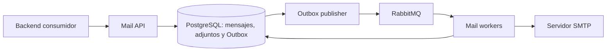

# Mail Platform

**Plataforma modular para correo transaccional, recuperación de contraseñas y envío de documentos mediante una API privada.** Permite centralizar la mensajería de varios proyectos sin acoplar cada backend directamente a un servidor SMTP.

[](https://openjdk.org/projects/jdk/25/)
[](https://spring.io/projects/spring-boot)
[](https://www.postgresql.org/)
[](https://www.rabbitmq.com/)
[](https://maven.apache.org/)
[](LICENSE)


**Versión de trabajo:** `0.10.6-SNAPSHOT` · **Arquitectura:** 8 módulos Maven · **Base de datos:** Flyway V1–V17.

> **Estado de validación:** el repositorio registra comprobaciones locales, pero todavía requiere evidencia de compilación integral con Java 25 y pruebas reales con PostgreSQL, RabbitMQ, SMTP y el proveedor definitivo. No se presenta como certificado para producción. Consulta el [informe de validación](VALIDATION_REPORT.md).

## ¿Qué problema resuelve?

Cada aplicación que necesita correo suele repetir la integración SMTP, las plantillas, los reintentos y el seguimiento de los mensajes. Mail Platform concentra esas responsabilidades en un servicio reutilizable. Los sistemas consumidores mantienen sus propios usuarios, contraseñas y documentos emitidos; Mail Platform gestiona la preparación, el encolado, el envío y el registro de los correos.

La plataforma puede utilizarse desde otros backends por medio de su API REST. Incluye un starter para Spring Boot y [guías para Python, Node.js y .NET](docs/INTEGRACION_MULTILENGUAJE_ES.md).

## Capacidades principales

| Área | Funcionalidades |
| --- | --- |
| Correo transaccional | Envío asíncrono, programación, cancelación, seguimiento e historial de intentos. |
| Recuperación de contraseñas | OTP de un solo uso y autorización temporal; la contraseña se modifica en el sistema consumidor. |
| Documentos y adjuntos | Validación de archivos, almacenamiento compartido en PostgreSQL y reenvío de facturas o boletas en PDF. |
| Plantillas | Versiones, publicación, vista previa y control de acceso por cliente. |
| Lotes y campañas | Envíos masivos, importación CSV, consentimiento comercial, exclusiones y enlaces de baja. |
| Integraciones | API REST, starter de Spring Boot y webhooks HTTPS firmados. |
| Seguridad | Credenciales por cliente, permisos por operación, cuotas, cifrado de información sensible y controles sobre adjuntos. |
| Fiabilidad y operación | Transactional Outbox, RabbitMQ, reintentos, métricas, auditoría y herramientas de respaldo. |

Las funcionalidades implementadas no implican por sí solas que se hayan completado las pruebas de infraestructura o de carga. Los resultados registrados y los pendientes están en [VALIDATION_REPORT.md](VALIDATION_REPORT.md).

## Arquitectura



La API registra cada mensaje y su evento Outbox en una transacción PostgreSQL. El publicador entrega los eventos a RabbitMQ y los workers procesan los mensajes, registran los intentos y aplican los reintentos correspondientes. Como RabbitMQ trabaja con semántica `at-least-once`, los consumidores deben tolerar la posibilidad excepcional de un correo duplicado cuando un servidor SMTP acepta el mensaje, pero se pierde su confirmación.

### Stack tecnológico

**Java 25**, **Spring Boot 4.1.1**, **Maven**, **PostgreSQL 17**, **Flyway**, **RabbitMQ 4**, **Thymeleaf**, **Spring Security**, **SMTP**, **OpenAPI**, **Actuator** y **Prometheus**. El entorno local con Docker Compose incorpora Mailpit para capturar mensajes de prueba.

### Organización de módulos

| Módulo | Responsabilidad |
| --- | --- |
| `mail-domain` | Modelos y reglas de dominio. |
| `mail-application` | Casos de uso y puertos. |
| `mail-template-engine` | Renderizado de plantillas. |
| `mail-provider-smtp` | Adaptador SMTP. |
| `mail-infrastructure` | Persistencia, Outbox, cifrado, adjuntos y RabbitMQ. |
| `mail-worker` | Envío, reintentos y recuperación. |
| `mail-api` | API REST, seguridad, OpenAPI y observabilidad. |
| `mail-client-spring-boot-starter` | Cliente reutilizable para otras aplicaciones Spring Boot. |

## Inicio rápido

**Requisitos:** JDK 25, PostgreSQL 17, RabbitMQ 4 y un servidor SMTP accesible. Docker es opcional; en este ejemplo solo levanta las dependencias de desarrollo.

**1. Configura el entorno.** Copia `.env.example` a `.env` y sustituye los valores de ejemplo por secretos independientes de desarrollo. Nunca publiques `.env` ni reutilices estas credenciales en producción.

```bash
cp .env.example .env
docker compose -f compose.dev.yml up -d
```

`compose.dev.yml` inicia PostgreSQL, RabbitMQ y Mailpit, **no la aplicación Java**.

**2. Compila y ejecuta la aplicación.**

```bash
./mvnw -B clean verify
./mvnw -pl mail-api -am spring-boot:run
```

En Windows, utiliza `.\mvnw.cmd` en lugar de `./mvnw`. Para ejecutar todos los servicios sin Docker, consulta la [guía para Windows](docs/EJECUCION_WINDOWS_ES.md). Por defecto, la API y los workers se inician en el mismo proceso; `APP_WORKER_ENABLED=false` permite separar las instancias dedicadas únicamente a API.

**3. Comprueba el flujo en un entorno de prueba.** Con los servicios en ejecución y un cliente de desarrollo autorizado:

```bash
E2E_CLIENT_ID=inventory E2E_API_KEY="<clave-de-desarrollo>" python3 scripts/e2e_smoke.py
```

Mailpit permite inspeccionar el correo capturado en `http://localhost:8025`. El script necesita credenciales y configuración de desarrollo coherentes. No ejecutes pruebas de carga o interrupción contra infraestructura productiva.

## Integración con otros sistemas

Las credenciales pertenecen exclusivamente al **backend consumidor**; nunca deben exponerse en el navegador. Las solicitudes a la API incluyen ambas cabeceras:

```http
X-Client-Id: inventory
X-Internal-Api-Key: <secreto-del-cliente>
```

Los clientes persistentes deben tener permisos explícitos según sus operaciones. `INTERNAL_API_KEYS` permite compatibilidad temporal con integraciones anteriores, pero no es el mecanismo recomendado para producción.

### Starter de Spring Boot

```properties
mail-platform.base-url=http://localhost:8080
mail-platform.client-id=inventory
mail-platform.api-key=${MAIL_PLATFORM_API_KEY}
mail-platform.connect-timeout=3s
mail-platform.read-timeout=15s
```

El starter configura `MailPlatformClient` para recuperación, correo, adjuntos, documentos, plantillas y campañas. Consulta la [guía de integración](docs/INTEGRATION_GUIDE.md) y los [ejemplos de solicitudes HTTP](docs/API_EXAMPLES.md) para configurar permisos y construir los cuerpos de petición.

### Endpoints de referencia

| Operación | Endpoint |
| --- | --- |
| Crear y consultar correos | `POST /api/v1/emails` · `GET /api/v1/emails/{id}` |
| Consultar intentos o cancelar | `GET /api/v1/emails/{id}/attempts` · `DELETE /api/v1/emails/{id}` |
| Solicitar recuperación | `POST /api/v1/password-recovery/challenges` |
| Verificar OTP | `POST /api/v1/password-recovery/challenges/{id}/verify` |
| Consumir autorización | `POST /api/v1/password-recovery/grants/consume` |
| Adjuntos y copias de documentos | `POST /api/v1/attachments` · `POST /api/v1/documents/copies` |
| Lotes y campañas | `POST /api/v1/batches` · `POST /api/v1/campaigns` |
| Importación CSV | `POST /api/v1/campaigns/import-csv` |

La autorización depende del cliente y de sus permisos. No todos los endpoints están disponibles con todas las credenciales.

## Seguridad y entregabilidad

- Los OTP se protegen mediante HMAC. Los datos sensibles necesarios para el envío se almacenan cifrados mediante AES-256-GCM y tienen caducidad.
- Los archivos se validan antes de aceptarse. El perfil `production` exige configuración segura, incluida la protección antivirus mediante ClamAV.
- Las claves y contraseñas deben administrarse mediante secretos independientes. Las integraciones frontend nunca deben recibir credenciales de Mail Platform.
- `SENT` significa **aceptado por el servidor SMTP**, no necesariamente entregado a la bandeja del destinatario. SPF, DKIM, DMARC, rebotes y monitorización externa deben comprobarse con el dominio y el proveedor reales.

Revisa la [política de seguridad](SECURITY.md) y los [requisitos previos a producción](docs/PRODUCTION_READINESS_ES.md) antes de desplegar.

## Estado técnico y documentación

| Recurso | Contenido |
| --- | --- |
| [Índice de documentación](docs/README.md) | Integración, arquitectura, operación y versiones anteriores. |
| [Estado técnico](PROJECT_STATUS.md) | Alcance de la versión actual y limitaciones conocidas. |
| [Validación](VALIDATION_REPORT.md) | Pruebas registradas y verificaciones de infraestructura pendientes. |
| [Auditoría](AUDIT_REPORT.md) | Hallazgos, mejoras y riesgos operativos. |
| [Certificación reproducible v0.10.6](docs/CERTIFICACION_V0106_ES.md) | Procedimientos de prueba; no constituye un certificado de producción. |
| [Historial de cambios](CHANGELOG.md) | Evolución de las versiones del proyecto. |

El repositorio incluye migraciones **Flyway V1–V17**. Antes de actualizar una instalación existente, realiza un respaldo verificable y consulta las instrucciones de migración y restauración. Los resultados registrados en `VALIDATION_REPORT.md` no deben interpretarse como evidencia de un despliegue certificado.

## Licencia

Mail Platform se distribuye bajo la licencia [MIT](LICENSE).
